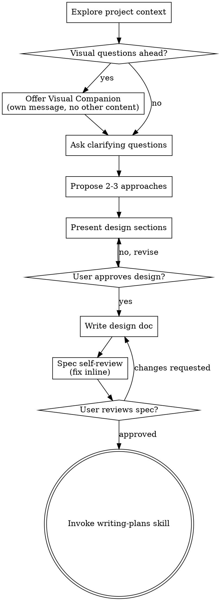

# Brainstorming Ideas Into Designs

Turn ideas into formed designs/specs via collaborative dialogue.

First understand project context. Ask one question at a time to refine idea. Once clear what to build, present design, get approval.

<HARD-GATE>
Do NOT invoke any implementation skill, write any code, scaffold any project, or take any implementation action until you have presented a design and the user has approved it. This applies to EVERY project regardless of perceived simplicity.
</HARD-GATE>

## Anti-Pattern: "This Is Too Simple To Need A Design"

Every project uses this process: todo list, single-function utility, config change — all. "Simple" projects hide assumptions, waste work. Design may be short (few sentences for truly simple projects), but MUST present it and get approval.

## Checklist

MUST create task for each item, complete in order:

1. **Explore project context** — check files, docs, recent commits
2. **Offer visual companion** (if topic will involve visual questions) — own message, not combined with clarifying question. See Visual Companion section below.
3. **Ask clarifying questions** — one at a time, understand purpose/constraints/success criteria
4. **Propose 2-3 approaches** — with trade-offs and recommendation
5. **Present design** — sections scaled to complexity, get user approval after each section
6. **Write design doc** — save to `docs/superfastpowers/specs/YYYY-MM-DD-<topic>-design.md` and commit
7. **Spec self-review** — quick inline check for placeholders, contradictions, ambiguity, scope (see below)
8. **User reviews written spec** — ask user to review spec file before proceeding
9. **Transition to implementation** — invoke writing-plans skill to create implementation plan

## Process Flow

**The terminal state is invoking writing-plans.** Do NOT invoke frontend-design, mcp-builder, or any other implementation skill. ONLY skill after brainstorming is writing-plans.

## The Process

**Understanding the idea:**

- Check current project state first (files, docs, recent commits)
- Before detailed questions, assess scope: if request has multiple independent subsystems (e.g., "build a platform with chat, file storage, billing, and analytics"), flag immediately. Don't refine details of project needing decomposition first.
- If project too large for one spec, help user decompose into sub-projects: independent pieces, relationships, build order. Then brainstorm first sub-project through normal design flow. Each sub-project gets own spec → plan → implementation cycle.
- For scoped projects, ask one question at a time to refine idea
- Prefer multiple choice questions when possible; open-ended OK
- Only one question per message - if topic needs more exploration, split into multiple questions
- Focus: purpose, constraints, success criteria

**Exploring approaches:**

- Propose 2-3 approaches with trade-offs
- Present options conversationally with recommendation + reasoning
- Lead with recommended option and why

**Presenting the design:**

- Once clear what to build, present design
- Scale each section to complexity: few sentences if simple, up to 200-300 words if nuanced
- Ask after each section whether it looks right so far
- Cover: architecture, components, data flow, error handling, testing
- Go back and clarify if something doesn't make sense

**Design for isolation and clarity:**

- Split system into small units with one clear purpose, well-defined interfaces, independently understandable/testable
- For each unit, answer: what it does, how to use it, what it depends on
- Can someone understand unit without internals? Can internals change without breaking consumers? If not, boundaries need work.
- Smaller, bounded units easier to reason about in context; edits more reliable in focused files. Large file often signals too much responsibility.

**Working in existing codebases:**

- Explore current structure before proposing changes. Follow existing patterns.
- Where existing code issues affect work (e.g., large file, unclear boundaries, tangled responsibilities), include targeted improvements in design - like good developer improving code being touched.
- Don't propose unrelated refactoring. Stay focused on current goal.

## After the Design

**Documentation:**

- Write validated design (spec) to `docs/superfastpowers/specs/YYYY-MM-DD-<topic>-design.md`
  - (User preferences for spec location override this default)
- Use elements-of-style:writing-clearly-and-concisely skill if available
- Commit design document to git

**Spec Self-Review:**
After writing spec document, review fresh:

1. **Placeholder scan:** Any "TBD", "TODO", incomplete sections, vague requirements? Fix them.
2. **Internal consistency:** Any contradictions? Does architecture match feature descriptions?
3. **Scope check:** Focused enough for one implementation plan, or needs decomposition?
4. **Ambiguity check:** Could any requirement mean two things? Pick one, make explicit.

Fix issues inline. No re-review needed — fix and continue.

**User Review Gate:**
After spec review loop passes, ask user to review written spec before proceeding:

> "Spec written and committed to `<path>`. Please review it and let me know if you want to make any changes before we start writing out the implementation plan."

Wait for user response. If they request changes, make them and re-run spec review loop. Proceed only once user approves.

**Implementation:**

- Invoke writing-plans skill to create detailed implementation plan
- Do NOT invoke any other skill. writing-plans is next step.

## Key Principles

- **One question at a time** - Don't overwhelm with multiple questions
- **Multiple choice preferred** - Easier than open-ended when possible
- **YAGNI ruthlessly** - Remove unnecessary features from all designs
- **Explore alternatives** - Always propose 2-3 approaches before settling
- **Incremental validation** - Present design, get approval before moving on
- **Be flexible** - Go back and clarify when something doesn't make sense

## Visual Companion

Browser companion shows mockups, diagrams, visual options during brainstorming. Available as tool — not mode. Accepting companion means available for questions benefiting from visual treatment; does NOT mean every question uses browser.

**Offering the companion:** When upcoming questions involve visual content (mockups, layouts, diagrams), offer once for consent:
> "Some of what we're working on might be easier to explain if I can show it to you in a web browser. I can put together mockups, diagrams, comparisons, and other visuals as we go. This feature is still new and can be token-intensive. Want to try it? (Requires opening a local URL)"

**This offer MUST be its own message.** Do not combine with clarifying questions, context summaries, or other content. Message contains ONLY offer above and nothing else. Wait for user response before continuing. If declined, proceed text-only.

**Per-question decision:** Even after user accepts, decide FOR EACH QUESTION whether to use browser or terminal. Test: **would the user understand this better by seeing it than reading it?**

- **Use the browser** for content that IS visual — mockups, wireframes, layout comparisons, architecture diagrams, side-by-side visual designs
- **Use the terminal** for content that is text — requirements questions, conceptual choices, tradeoff lists, A/B/C/D text options, scope decisions

UI topic not automatically visual question. "What does personality mean in this context?" is conceptual — use terminal. "Which wizard layout works better?" is visual — use browser.

If they agree to companion, read detailed guide before proceeding:
`skills/brainstorming/visual-companion.md`
