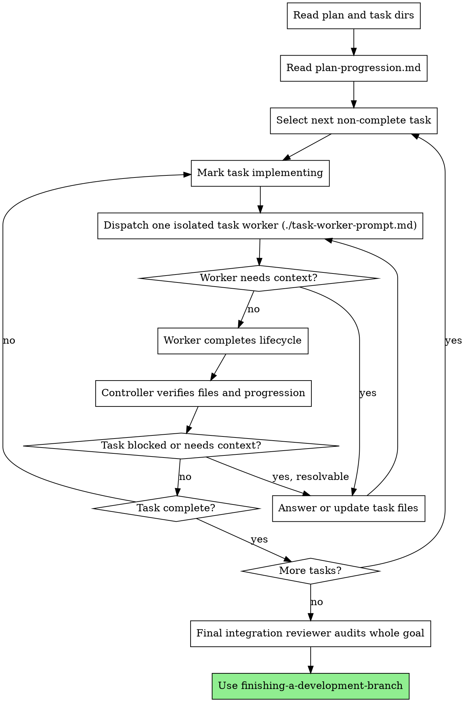

# Goal-Driven Development

Execute pre-split plan by walking task package dirs one at time. Use `plan-progression.md` for stage/status. Keep detail in task-local files.

**Core principle:** Controller context stays small; implementation and review findings live in each task dir.

**Execution mechanism:** Main agent = lightweight controller. If harness supports isolated workers, dispatch one isolated worker per task. Worker owns full task lifecycle: implementation, spec review, quality review, review-fix loops. Controller keeps one active goal for whole plan, picks next task, verifies files/progression after worker returns, and avoids carrying task detail in chat.

If isolated workers unavailable, run same per-task lifecycle inline. Still keep findings in task files. Summarize hard before next task.

**Continuous execution:** Do not pause between tasks. Execute all plan tasks. Stop only for unresolved BLOCKED, ambiguity blocking progress, or all tasks done.

## When to Use

Use when:
- Implementation plan already split into task dirs
- Each task dir has `context.md`
- Review findings and handoffs must stay with owning task
- Need controller loop through implementation, spec review, code quality review

Do not use for ordinary plans without per-task dirs. Use `subagent-driven-development` instead.

## Entry Point

At start:
1. Confirm one active implementation goal, or create one for whole plan.
2. Locate plan file, task package root, and `plan-progression.md`.
3. If `plan-progression.md` missing, stop and use `writing-plans` to create task packages and progression first.
4. Select first task whose `Task status` is not `complete`.
5. Dispatch one task worker, or run task worker template inline if worker isolation unavailable.

If user chose Goal-Driven execution from `writing-plans`, start here immediately after `plan-progression.md` exists.

## Required Task Package Shape

Each task dir must contain:

```text
tasks/<TASK-ID>/
  context.md
```

Create as loop needs:

```text
tasks/<TASK-ID>/
  implementer-handoff.md
  spec-review.md
  code-quality.md
```

`context.md`: running task map: summary, relevant files, commit SHA or reviewed range, verification commands, notes later agents need.

`implementer-handoff.md`: current repair brief. Reviewers write concise actionable fixes here when review fails.

`spec-review.md`: spec compliance review detail.

`code-quality.md`: code quality review detail.

## Plan Progression File

`writing-plans` creates initial `plan-progression.md` next to plan or task root. Keep concise. Not review log.

Shape:

```markdown
# Plan Progression

Last updated: YYYY-MM-DD HH:MM

## Task 1: Name

- Path: tasks/TASK-1
- Task status: pending
- Implementer: unchecked
- Spec review: unchecked
- Code quality: unchecked
- Next action: Start implementation.
```

Allowed `Status` values:
- `pending`
- `implementing`
- `spec-checking`
- `quality-checking`
- `complete`
- `blocked`

Allowed `Spec` values:
- `unchecked`
- `checked`
- `failed`

Allowed `Implementer` values:
- `unchecked`
- `checked`
- `failed`

Allowed `Quality` values:
- `unchecked`
- `checked`
- `failed`
- `checked-with-minor-notes`

`Next action` = one concise sentence. Details belong in task dir.

Examples:
- `Fix spec findings in tasks/GD-2/spec-review.md.`
- `Run quality review.`
- `Task complete; continue to next task.`

## Process



## Session Goal Responsibilities

Start execution with one active goal for whole implementation plan. Keep it active until every task plus final integration review complete, or work genuinely blocked.

Do not create separate Codex goal per task or phase. Codex goal tracks overall objective. Task workers give context isolation.

Before each task worker:
1. Read `plan-progression.md` enough to select next non-complete task.
2. Ensure task `context.md` exists.
3. Mark task `implementing` with concise `Next action`.
4. Dispatch `./task-worker-prompt.md` with exact paths for plan, task dir, task context, handoff/review files, progression file.
5. Do not paste unrelated previous task details into worker prompt.

After each task worker:
1. Verify required files updated.
2. Verify `plan-progression.md` matches task-local review files.
3. Keep `Next action` concise.
4. If task incomplete but not blocked, dispatch fresh worker for same task using only task files and current handoff.
5. Continue until every task complete or genuinely blocked.

If `plan-progression.md` disagrees with task-local review files, task-local review file wins. Correct progression before continuing.

## Commit Policy

Prefer one commit per task. Implementer may amend task commit while fixing review findings if repo policy permits. If follow-up commits unavoidable, `context.md` must record reviewed commit range.

Reviewers must inspect actual changed files. Prefer task commit or reviewed range from `context.md`. If work uncommitted, inspect staged and unstaged diff before review.

## Phase Templates

- `./task-worker-prompt.md` - Task worker full lifecycle instructions
- `./implementer-prompt.md` - Implementer phase instructions
- `./spec-reviewer-prompt.md` - Spec compliance review phase instructions
- `./code-quality-reviewer-prompt.md` - Code quality review phase instructions

## Task Worker Template

Use one isolated task worker per task when harness supports it. Worker runs implementer, spec review, and code quality review phases for only that task. Phase templates are role checklists inside worker, not separate worker dispatches.

Controller gives worker paths and concise task context. Worker reads task-local files, inspects relevant code, updates durable files, returns short report. Controller should not retain detailed review findings in chat; those belong in `spec-review.md`, `code-quality.md`, and `implementer-handoff.md`.

## Handoff Rules

Reviewers write detailed findings in task-local files, not `plan-progression.md`.

When review fails inside task worker:
- Reviewer updates review file with findings.
- Reviewer updates `implementer-handoff.md` with required fixes.
- Reviewer marks review `failed` in `plan-progression.md`.
- Worker runs implementer phase again for same task with handoff path.

When review passes inside task worker:
- Reviewer updates review file with short pass record and evidence.
- Reviewer marks review `checked` in `plan-progression.md`.
- Worker advances to next phase, or marks task complete after quality review passes.

Spec review strict: any missing, extra, or misunderstood requirement = `failed`.

Code quality may pass with minor notes when issues are outside task goal or not worth blocking. Record notes in `code-quality.md`; mark `Code quality: checked-with-minor-notes`. Code quality is final per-task gate and sets `Task status: complete` when task acceptable.

After implementer finishes review-fix pass, clear `implementer-handoff.md`: replace with short resolved note naming commit or range.

## Final Integration Review

After all tasks complete, run one final integration review phase. Audit whole goal, not each task alone.

Final reviewer reads:
- Original plan
- `plan-progression.md`
- Every task `context.md`
- Every `spec-review.md`
- Every `code-quality.md`
- Final combined diff or commit range

Check:
- All tasks complete or explicitly accepted with minor quality notes
- No spec failure remains unresolved
- Task boundaries integrate cleanly
- No later task regressed earlier task
- Tests and verification evidence cover combined behavior
- No uncommitted or unreviewed changes remain

Final findings go in goal-level `final-review.md` next to `plan-progression.md`.

## Red Flags

Never:
- Put detailed review findings in `plan-progression.md`
- Move to code quality review before spec review is `checked`
- Mark task complete before spec is `checked` and quality is `checked` or `checked-with-minor-notes`
- Let implementer ignore `implementer-handoff.md`
- Leave active handoff after implementer reports DONE
- Leave stale failed review files without fresh pass record
- Dispatch separate workers for implementer/spec/quality phases
- Run multiple task workers in parallel
- Give task worker details from unrelated prior tasks
- Keep detailed implementation or review history in controller context
- Create separate Codex goals for each task or phase
- Skip updating `context.md` after implementation or repair work
- Treat `plan-progression.md` as proof work is correct
