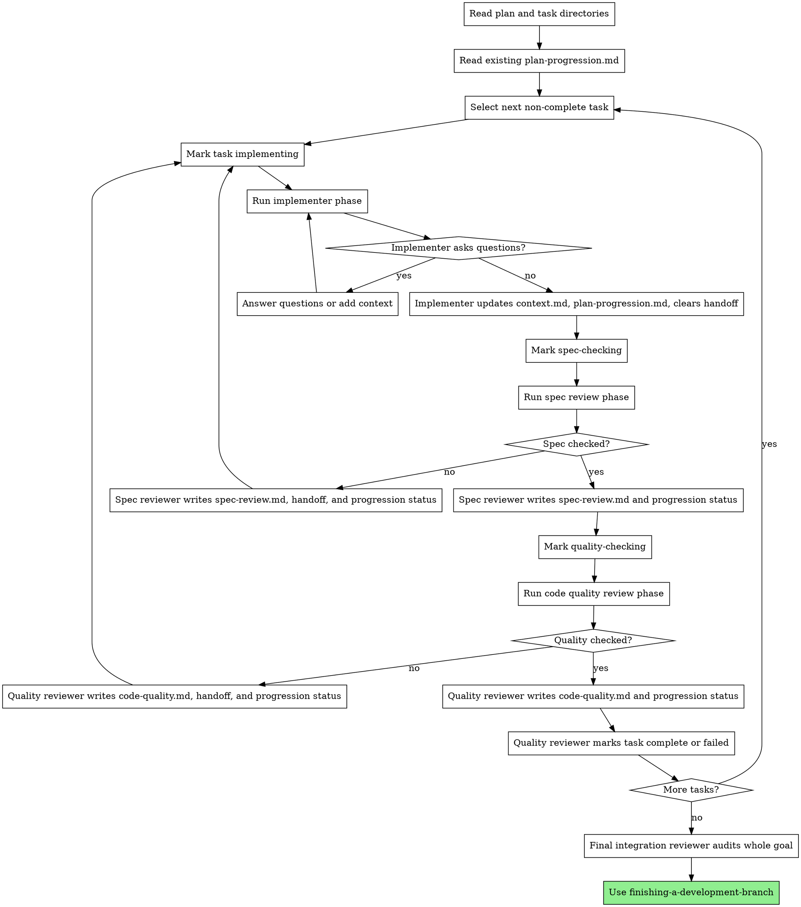

# Goal-Driven Development

Execute a pre-split plan by walking task package directories one at a time, using `plan-progression.md` for task stage/status and task-local files for detailed review loops.

**Core principle:** Keep global progress concise; keep detailed implementation and review findings inside each task's own directory.

**Execution mechanism:** Do not spawn or dispatch subagents. In Codex, use the `goal` tool only to track the overall active implementation objective. The main agent executes each implementer, spec review, code quality review, and final integration review phase sequentially in the same session, using the phase templates below as instructions. If OMP has richer goal semantics, adapt only where the tool genuinely supports it; do not imply worker isolation unless the harness provides it.

**Continuous execution:** Do not pause to check with the human between tasks. Execute all plan tasks without stopping. Stop only for BLOCKED you cannot resolve, ambiguity blocking progress, or all tasks done.

## When to Use

Use this when:
- An implementation plan is already split into task directories
- Each task directory has `context.md`
- Review findings and handoffs should stay with the task they belong to
- You need a controller loop that moves each task through implementation, spec review, and code quality review

Do not use this for ordinary plans that are not packaged into per-task directories. Use `subagent-driven-development` instead.

## Entry Point

When this skill starts:
1. Confirm there is one active implementation goal, or create it for the whole plan.
2. Locate the plan file, task package root, and `plan-progression.md`.
3. If `plan-progression.md` is missing, stop and use `writing-plans` to create task packages and progression first.
4. Select the first task whose `Task status` is not `complete`.
5. Begin the phase loop for that task.

If the user chose Goal-Driven execution directly from `writing-plans`, start here immediately after `plan-progression.md` is created.

## Required Task Package Shape

Each task directory must contain:

```
tasks/<TASK-ID>/
  context.md
```

Create these files as the loop needs them:

```
tasks/<TASK-ID>/
  implementer-handoff.md
  spec-review.md
  code-quality.md
```

`context.md` is the running task map: task summary, relevant files, commit SHA or reviewed commit range, verification commands, and notes needed by later agents.

`implementer-handoff.md` is the current repair brief for the implementer. Reviewers write concise, actionable instructions here when a review fails.

`spec-review.md` contains the spec compliance review details.

`code-quality.md` contains the code quality review details.

## Plan Progression File

`writing-plans` creates the initial `plan-progression.md` next to the plan or task root. Keep it concise. It is not a review log.

Use this shape:

```markdown
# Plan Progression

Last updated: YYYY-MM-DD HH:MM

## Task 1: Name

- Path: tasks/TASK-1
- Task status: pending
- Implementer: unchecked
- Spec review: unchecked
- Code quality: unchecked
- Next action: Start implementation.
```

Allowed `Status` values:
- `pending`
- `implementing`
- `spec-checking`
- `quality-checking`
- `complete`
- `blocked`

Allowed `Spec` values:
- `unchecked`
- `checked`
- `failed`

Allowed `Implementer` values:
- `unchecked`
- `checked`
- `failed`

Allowed `Quality` values:
- `unchecked`
- `checked`
- `failed`
- `checked-with-minor-notes`

`Next action` must be one concise sentence. Put details in the task directory.

Examples:
- `Fix spec findings in tasks/GD-2/spec-review.md.`
- `Run quality review.`
- `Task complete; continue to next task.`

## The Process



## Session Goal Responsibilities

At the start of execution, create or confirm one active goal for the whole implementation plan. Keep that goal active until every task and the final integration review are complete, or until the work is genuinely blocked.

Do not create a separate Codex goal for each role phase. Codex goals track objectives; they do not run isolated workers or scoped role prompts.

Before each phase:
1. Read the task's `context.md`
2. Read current task-local handoff/review files if they exist
3. Ensure `plan-progression.md` reflects the current stage
4. Follow the relevant phase template
5. Use the exact file paths the phase must update

After each phase completes:
1. Verify required files were updated
2. Verify `plan-progression.md` matches task-local review files
3. Keep `Next action` concise
4. Continue the loop until the task is complete or genuinely blocked

If `plan-progression.md` disagrees with task-local review files, the task-local review file wins. Correct progression before continuing.

## Commit Policy

Prefer one commit per task. The implementer may amend the task commit while fixing review findings, if repository policy permits. If follow-up commits are unavoidable, `context.md` must record the reviewed commit range.

Reviewers must inspect the actual changed files. Prefer the task commit or reviewed range from `context.md`; if work is uncommitted, inspect the staged and unstaged diff before reviewing.

## Phase Templates

- `./implementer-prompt.md` - Implementer phase instructions
- `./spec-reviewer-prompt.md` - Spec compliance review phase instructions
- `./code-quality-reviewer-prompt.md` - Code quality review phase instructions

## Handoff Rules

Reviewers must write detailed findings in task-local files, not in `plan-progression.md`.

When a review fails:
- Reviewer updates its review file with findings
- Reviewer updates `implementer-handoff.md` with required fixes
- Reviewer marks its review as `failed` in `plan-progression.md`
- Controller sends the implementer back to the same task with the handoff path

When a review passes:
- Reviewer updates its review file with a short pass record and evidence
- Reviewer marks its review as `checked` in `plan-progression.md`
- Controller advances to the next stage

Spec review is strict: any missing, extra, or misunderstood requirement is `failed`.

Code quality review may pass with minor notes when issues are outside the task goal or not worth blocking the task. Record those notes in `code-quality.md` and mark `Code quality: checked-with-minor-notes`. Code quality is the final per-task gate and is responsible for setting `Task status: complete` when the task can be accepted.

After the implementer finishes a review-fix pass, they must clear `implementer-handoff.md` by replacing it with a short resolved note that names the commit or range that addressed it.

## Final Integration Review

After all tasks are complete, run one final integration review phase to audit the whole goal, not each task in isolation.

The final reviewer reads:
- Original plan
- `plan-progression.md`
- Every task `context.md`
- Every `spec-review.md`
- Every `code-quality.md`
- The final combined diff or commit range

They check:
- All tasks are complete or explicitly accepted with minor quality notes
- No spec failure remains unresolved
- Task boundaries integrate cleanly
- No later task regressed an earlier task
- Tests and verification evidence cover the combined behavior
- No uncommitted or unreviewed changes remain

Final review findings go in a goal-level `final-review.md` next to `plan-progression.md`.

## Red Flags

Never:
- Put detailed review findings in `plan-progression.md`
- Move to code quality review before spec review is `checked`
- Mark a task complete before spec is `checked` and quality is `checked` or `checked-with-minor-notes`
- Let the implementer ignore `implementer-handoff.md`
- Leave an active handoff after the implementer reports DONE
- Leave stale failed review files without a fresh pass record
- Spawn or dispatch subagents for this skill
- Create separate Codex goals for each phase
- Run multiple implementer phases against different tasks in parallel
- Skip updating `context.md` after implementation or repair work
- Treat `plan-progression.md` as proof that work is correct
