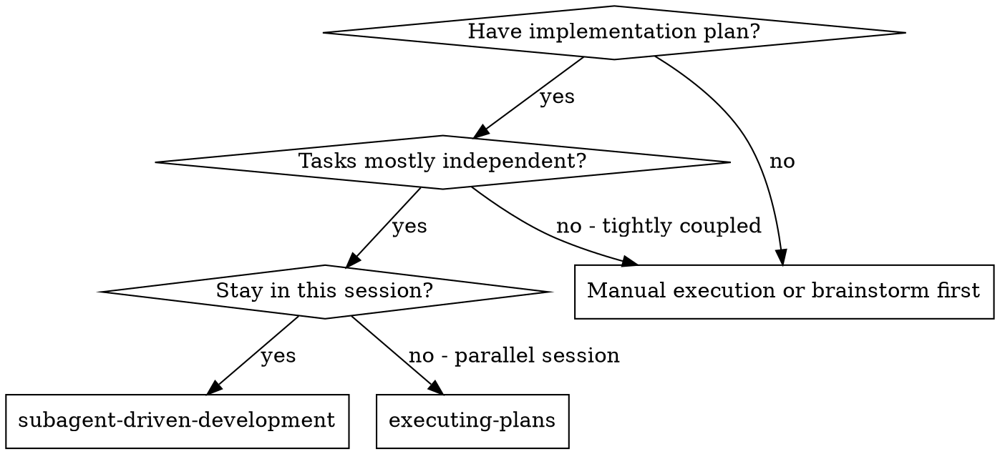
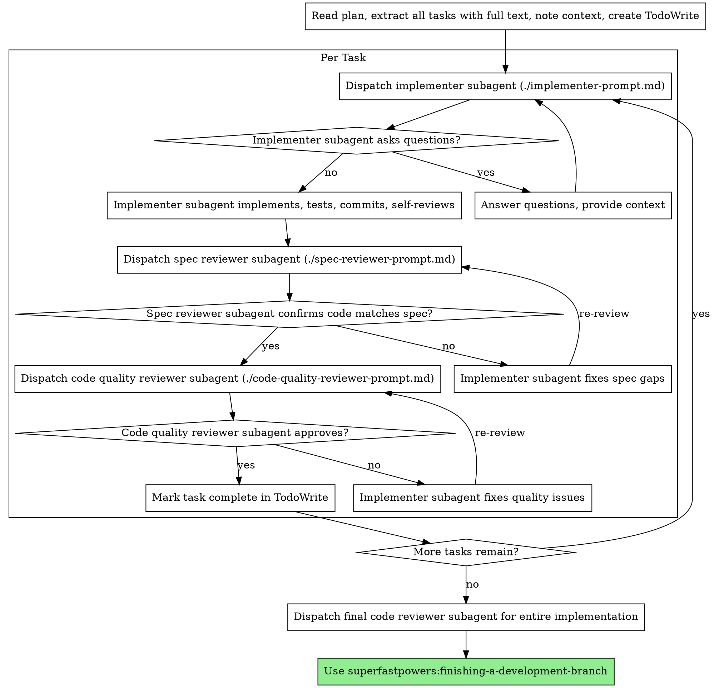

# Subagent-Driven Development

Execute plan by fresh subagent per task, with two-stage review after each: spec compliance, then code quality.

**Why subagents:** Delegate to specialized agents with isolated context. Craft exact instructions + context so they stay focused and succeed. They never inherit session context/history; provide only needed inputs. Keeps your context for coordination.

**Core principle:** Fresh subagent per task + two-stage review (spec then quality) = high quality, fast iteration

**Continuous execution:** Do not pause to check with human between tasks. Execute all plan tasks without stopping. Stop only for BLOCKED you cannot resolve, ambiguity blocking progress, or all tasks done. "Should I continue?" prompts and progress summaries waste time — they asked you to execute plan, so execute.

## When to Use



**vs. Executing Plans (parallel session):**
- Same session (no context switch)
- Fresh subagent per task (no context pollution)
- Two-stage review after each task: spec compliance first, then code quality
- Faster iteration (no human-in-loop between tasks)

## The Process



## Model Selection

Use least powerful model that can handle role, conserving cost + increasing speed.

**Mechanical implementation tasks** (isolated functions, clear specs, 1-2 files): use fast, cheap model. Most implementation tasks are mechanical when plan is well-specified.

**Integration and judgment tasks** (multi-file coordination, pattern matching, debugging): use standard model.

**Architecture, design, and review tasks**: use most capable available model.

**Task complexity signals:**
- Touches 1-2 files with a complete spec → cheap model
- Touches multiple files with integration concerns → standard model
- Requires design judgment or broad codebase understanding → most capable model

## Handling Implementer Status

Implementer subagents report one of four statuses. Handle each right:

**DONE:** Proceed to spec compliance review.

**DONE_WITH_CONCERNS:** Work complete but doubts flagged. Read concerns before proceeding. If correctness/scope concern, fix before review. If observation (e.g., "this file is getting large"), note and proceed.

**NEEDS_CONTEXT:** Implementer lacks needed info. Provide missing context and re-dispatch.

**BLOCKED:** Implementer cannot complete task. Assess blocker:
1. If context problem, provide more context and re-dispatch with same model
2. If task needs more reasoning, re-dispatch with more capable model
3. If task too large, split smaller
4. If plan wrong, escalate to human

**Never** ignore escalation or force same model retry unchanged. If implementer stuck, something must change.

## Prompt Templates

- `./implementer-prompt.md` - Dispatch implementer subagent
- `./spec-reviewer-prompt.md` - Dispatch spec compliance reviewer subagent
- `./code-quality-reviewer-prompt.md` - Dispatch code quality reviewer subagent

## Example Workflow

```
You: I'm using Subagent-Driven Development to execute this plan.

[Read plan file once: docs/superfastpowers/plans/feature-plan.md]
[Extract all 5 tasks with full text and context]
[Create TodoWrite with all tasks]

Task 1: Hook installation script

[Get Task 1 text and context (already extracted)]
[Dispatch implementation subagent with full task text + context]

Implementer: "Before I begin - should the hook be installed at user or system level?"

You: "User level (~/.config/superfastpowers/hooks/)"

Implementer: "Got it. Implementing now..."
[Later] Implementer:
  - Implemented install-hook command
  - Added tests, 5/5 passing
  - Self-review: Found I missed --force flag, added it
  - Committed

[Dispatch spec compliance reviewer]
Spec reviewer: ✅ Spec compliant - all requirements met, nothing extra

[Get git SHAs, dispatch code quality reviewer]
Code reviewer: Strengths: Good test coverage, clean. Issues: None. Approved.

[Mark Task 1 complete]

Task 2: Recovery modes

[Get Task 2 text and context (already extracted)]
[Dispatch implementation subagent with full task text + context]

Implementer: [No questions, proceeds]
Implementer:
  - Added verify/repair modes
  - 8/8 tests passing
  - Self-review: All good
  - Committed

[Dispatch spec compliance reviewer]
Spec reviewer: ❌ Issues:
  - Missing: Progress reporting (spec says "report every 100 items")
  - Extra: Added --json flag (not requested)

[Implementer fixes issues]
Implementer: Removed --json flag, added progress reporting

[Spec reviewer reviews again]
Spec reviewer: ✅ Spec compliant now

[Dispatch code quality reviewer]
Code reviewer: Strengths: Solid. Issues (Important): Magic number (100)

[Implementer fixes]
Implementer: Extracted PROGRESS_INTERVAL constant

[Code reviewer reviews again]
Code reviewer: ✅ Approved

[Mark Task 2 complete]

...

[After all tasks]
[Dispatch final code-reviewer]
Final reviewer: All requirements met, ready to merge

Done!
```

## Advantages

**vs. Manual execution:**
- Subagents follow TDD naturally
- Fresh context per task (no confusion)
- Parallel-safe (subagents don't interfere)
- Subagent can ask questions (before AND during work)

**vs. Executing Plans:**
- Same session (no handoff)
- Continuous progress (no waiting)
- Review checkpoints automatic

**Efficiency gains:**
- No file reading overhead (controller provides full text)
- Controller curates exact needed context
- Subagent gets complete information upfront
- Questions surface before work begins (not after)

**Quality gates:**
- Self-review catches issues before handoff
- Two-stage review: spec compliance, then code quality
- Review loops ensure fixes work
- Spec compliance prevents over/under-building
- Code quality ensures implementation well-built

**Cost:**
- More subagent invocations (implementer + 2 reviewers per task)
- Controller does more prep (extracting all tasks upfront)
- Review loops add iterations
- Catches issues early (cheaper than later debugging)

## Red Flags

**Never:**
- Start implementation on main/master branch without explicit user consent
- Skip reviews (spec compliance OR code quality)
- Proceed with unfixed issues
- Dispatch multiple implementation subagents in parallel (conflicts)
- Make subagent read plan file (provide full text instead)
- Skip scene-setting context (subagent needs to understand where task fits)
- Ignore subagent questions (answer before letting them proceed)
- Accept "close enough" on spec compliance (spec reviewer found issues = not done)
- Skip review loops (reviewer found issues = implementer fixes = review again)
- Let implementer self-review replace actual review (both are needed)
- **Start code quality review before spec compliance is ✅** (wrong order)
- Move to next task while either review has open issues

**If subagent asks questions:**
- Answer clearly and completely
- Provide additional context if needed
- Don't rush them into implementation

**If reviewer finds issues:**
- Implementer (same subagent) fixes them
- Reviewer reviews again
- Repeat until approved
- Don't skip the re-review

**If subagent fails task:**
- Dispatch fix subagent with specific instructions
- Don't try to fix manually (context pollution)

## Integration

**Required workflow skills:**
- **superfastpowers:using-git-worktrees** - Ensures isolated workspace (creates one or verifies existing)
- **superfastpowers:writing-plans** - Creates the plan this skill executes
- **superfastpowers:requesting-code-review** - Code review template for reviewer subagents
- **superfastpowers:finishing-a-development-branch** - Complete development after all tasks

**Subagents should use:**
- **superfastpowers:test-driven-development** - Subagents follow TDD for each task

**Alternative workflow:**
- **superfastpowers:executing-plans** - Use for parallel session instead of same-session execution
